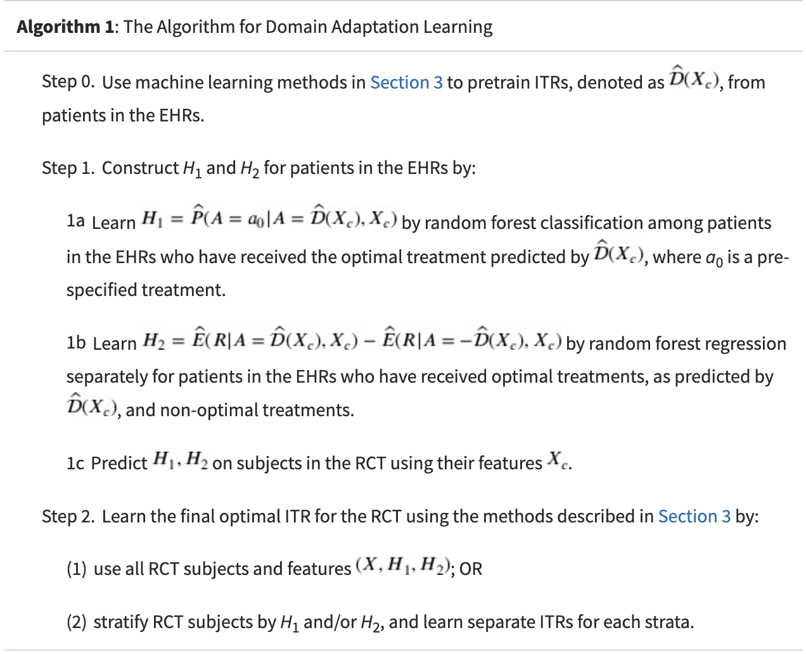

---
output:
  html_document:
    toc: yes
    toc_depth: 5
    toc_float: yes
  pdf_document:
    toc: yes
    toc_depth: '5'
editor_options: 
  markdown: 
    wrap: 72
---


## 1. Background
This repository offers an overview of various methods aimed at addressing challenges in estimating optimal Dynamic Treatment Regimes (DTRs) and Individualized Treatment Rules (ITRs). Section 2 outlines the general conceptual framework and notations used in the subsequent content. Section 3 presents two methods designed to enhance the efficiency of Outcome Weighted Learning (OWL) in multi-stages and expand its application from randomized controlled trial (RCT) data to electronic health record (EHR) data in a single-stage setting. Section 4 introduces two methods for improving optimal DTR estimation by integrating data from randomized and observational studies. Finally, Section 5 discusses two approaches for assessing optimal DTR estimation with risk control, addressing the benefit-risk tradeoff challenges often encountered in personalized medicine, particularly for chronic diseases. The example given in the repository mostly comes from simulation study. Papers of reference can be found at: (https://github.com/YeYao843/DTR-Method-Summary/tree/main/Reference%20paper)


## 2. Conceptual Framework

For k = 1, 2,..., K, we consider estimating K-stage DTR:

* $X_k$ : observed subject-specific tailoring variables collected prior to the treatment assignment at stage k
* $A_k$ : treatment assignment taking values in {-1, 1}.
* $R_k$ : outcome post k-th stage treatment
* $H_k = (X_1, A_1, R_1, ... , A_{k-1}, R_{k-1}, X_k)$ : patient history information at stage k
* $D = (D_{1}, D_{2}, \dots, D_{K})$ : DTRs or sequence of decision functions 
* $V(D) = E_D{[\sum_{k=1}^{K} R_k]} = = \int {\sum_{k=1}^{K} R_k} \mathrm{d} P_D$ : value function 

We use the potential outcome framework from causal inference, where the **potential outcome** represents the result if a subject had followed a specific treatment regimen, which may differ from the actual regimen received during the trial. Several **assumptions** are required: 

* Standard stable unit treatment value assumption
* No unmeasured confounders assumption (satisfied in a SMART design) 
* Positivity assumption: each DTR has a positive chance of being observed. $\pi_{k}(a,h_{k}) = P(A_{k}=a|H_{k}=h_{k}) \in \left[c,\tilde{c}\right]$, where $0<c<\tilde{c}<1$

According to the work of Qian and Murphy (1):

$$
V(D) = E[\frac{\prod_{k=1}^{K} I(A_k = 𝒟ₖ(H_k))(\sum_{k=1}^{K} R_k)}{ \prod_{k=1}^{K} \pi_k(A_k, H_k) }]
$$

Our **goal** is to determine the optimal DTRs $D^*=(D_{1}^*,D_{2}^*,\dots, D_{K}^*)$ that maximize the above value function. Note that $D_{k}(H_k)=\text{sign}(f_{k}(H_k))$. For clarity, we sometimes denote the value function as $V(f_1, f_2, ... , f_K)$.


### 3.1 Augmented outcome-weighted learning

#### <span style="color:grey;">Introduction</span>

Given the paper "Augmented outcome-weighted learning for estimating optimal dynamic treatment regimens", we develop the **Augmented Outcome-Weighted Learning (AOL)** method to integrate existing Outcome-Weighted Learning (OWL) method with regression models for Q-functions to estimate DTRs. It **expands data utilization** to include all patients, even those whose later-stage treatments are not optimal, thereby reducing information loss and **enhancing the stability and accuracy** of DTR estimates compared to OWL. 

####  <span style="color:grey;">Method</span>

This main idea of AOL is to enhance OWL in two aspects. The first aspect is to reduce variability by replacing $R_k$ with some surrogate variable. For example when K=1:

\[
V({D}) = \mathbb{E} \left[ 
\frac{\mathbb{I}(A_1 f(H_1) > 0) R_1}{\pi_1(A_1, H_1)} 
\right]
\]

\[
= \mathbb{E} \left[
\frac{\mathbb{I}(A_1 f(H_1) > 0)(R_1 - s(H_1))}{\pi_1(A_1, H_1)} 
\right] + \mathbb{E}[s(H_1)]
\]

\[
= \mathbb{E} \left[
\frac{|R_1 - s(H_1)|}{\pi_1(A_1, H_1)} \mathbb{I}(A_1 \, \text{sign}(R_1 - s(H_1)) f(H_1) > 0) 
\right] + \mathbb{E}[s(H_1)]
- \mathbb{E} \left[
\frac{(R_1 - s(H_1))^-}{\pi_1(A_1, H_1)}
\right],
\]

where \((x)^- = -\min(0, x)\). Therefore, maximizing \({V}({D})\) is equivalent to maximizing:

\[
\mathbb{E} \left[
\frac{|R_1 - s(H_1)|}{\pi_1(A_1, H_1)} \mathbb{I}(A_1 \, \text{sign}(R_1 - s(H_1)) f(H_1) > 0)
\right].
\]
The second aspect emphasizes reducing information loss through outcome augmentation. For this purpose, a key outcome $Q_k$ is defined as the cumulative reward from current stage if a subject follows the optimal treatments in all subsequent stages. In addition to exclude subjects whose treatment assignments in later stages do not align with the optimal treatments, we use $H_k$ to predict $Q_k$ through augmentation for those subjects with missing $Q_k$. An augmented  $Q_2$  is defined as $m_{22}(H_2)$, which approximates the optimal reward increment

#### <span style="color:grey;">Algorithm</span>

<p align="center">
    
</p>


#### <span style="color:grey;">Example</span>
To install the released package from CRAN:
```r
install.packages("DTRlearn2")
```
load it into your session:

```r
library(DTRlearn2)
```

* **Step 1 : This function implements a variety of outcome-weighted learning methods for estimating general 2-stage DTRs**
```r
fit_owl = owl(H=list(H1, H2), AA=list(a1,a2), RR=list(rep(0, n), y),
              n=n, K=2, pi=list(rep(0.5, n), rep(0.5,n)), res.lasso = TRUE,
              loss="hinge", kernel="linear", augment=TRUE, c=c, m=3)
```

* **Step 2 : Predict from a Fitted "owl" Object**
   + It can recommend treatments for a new independent sample with partial or full subject features observed up to a certain stage. 
   + If subject feautures, treatment assignments and outcomes are fully observed in the new sample, this function can also evaluate the estimated DTR on this new sample, returning the empirical value function and benefit function.
 
```r
# estimate DTR with owl on the training sample
owl_train = owl(H=list(H1_train, H2_train), AA=train$A, RR=train$R, n=n_train, K=2,
    pi=pi_train, loss='hinge', augment=TRUE, m=3)
```

A list of results: 
```r
#estimated coefficient of H1 in decision function of stage 1
fit_owl$stage1$beta

#the estimated probability for each subject
fit_owl$stage1$treatment

#overall empirical benefit function under estimated DTR
fit_owl$valuefun
```


```r
# evaluate the DTR when full information are observed on the new sample
owl_test = predict(owl_train, H=list(H1_test, H2_test), AA=test$A, RR=test$R, K=2)

```

A list of output 
```r
#recommended optimal treatments at the K stages for each subject in test sample
owl_test$treatment

#overall value function under fitted DTR evaluated on the test sample 
owl_test$valuefun

#treatment assignment probabilities in test sample
owl_test$pi

```

### 3.2 Matched Learning 

#### <span style="color:grey;">Introduction</span>

We introduced **Matched Learning (M-learning)**, a new machine learning approach that applies matching to estimate **ITRs** by aligning treatment responses of treated and untreated subjects using **EHR** data. M-learning integrates aspects of O-learning and AOL within its framework, employing matching-based functions to address confounding in different data types (continuous, discrete, or ordinal). Enhanced by **denoising and doubly robust** matching techniques, M-learning is implemented using a **weighted support vector machine**, demonstrating improved performance over existing methods, especially when dealing with misspecified propensity scores or unmeasured confounders. 

#### <span style="color:grey;">Method</span>

* **Step 1: Matching Subjects**

Matching methods facilitate balanced comparisons of treatment responses by ensuring key confounders are well-matched within subgroups or at the individual level. In our method, we denote the matched set $M_i$ for subject i, which consists of subjects with opposite treatments but similar covariates as subject i. That is: 

$$M_i= \{j: A_j = -A_i, d(H_j, H_i) \le \delta_i\}$$

where $\delta_i$ is a pre-specified positive threshold to determine the size of the matched set. This method employs nearest neighbor matching during the M learning process.

* **Step 2: Optimization using Matching Based Value Function**

The **motivation** of M learning is that when two subjects are matched in confounders or propensity scores of treatments but are observed to receive opposite treatments, the subject with a larger clinical outcome should be more likely to have received the optimal treatment among two options. The objective function to be optimized is the loss function for the weighted support vector machine(SVM) with matched pairs : 

$$V_{n,\phi}(f;g) = n^{-1} \sum_{i = 1}^{n} |M_{i}|^{-1} \sum_{j \in M_{i}} \phi(-f(H_{i})A_{i}sign(R_{j}-R_{i}))g(|R_{j}-R_{i}|)+\lambda_{n}||f||_{H_K}$$

where $|M_i|$ is the size of $M_i$ and $\phi(x)=(1-x)_+$. $g(.)$ is a monotonically increasing function specified by users to weight different pairs of subjects. Typical choices of $g(.)$ can be $g(x) = 1$ or $g(x) = x$. The objective function can be further expanded to include multiple treatment episodes from the same subject (assuming no carryover effect), so $i$ and $j$ can refer to different episodes from the same subject.

The solution to M-learning is obtained by minimizing $V_{n,\phi}(f;g)$. In terms of implementation, the dual problem of this objective function is a quadratic problem which can be solved by any off-the-shelf quadratic programming packages.

* **Improved Matched Learning**

To improve the performance of M-learning, we use a **de-noise procedure** by replacing $R_i$ by a surrogate outcome $\tilde{R_i}=R_i-s(H_i)$ in $V_n(f;g)$. These residualized outcomes improves efficiency of identifying tailoring variables exhibiting quantitative or qualitative interaction with treatment.

Furthermore, prognostic scores can be incorporated into M-learning under the framework of **doubly robust matching estimator(DRME)**, which uses both propensity scores and prognostic scores to construct a matching set $M(i,\theta)$, where $\theta=(\theta_1,\theta_2)^T$.

$$\pi(H)=P(A=1|H)=\mu_1(H^T\theta_1)$$
$$m(H)=E(R|A=-1,H)=\mu_2(H^T\theta_2)$$

The doubly robust M-learning is consistent even if one of the propensity score model or prognostic model is misspecified, and it will be more efficient than regular M-learning if both models are correctly specified.

#### <span style="color:grey;">Algorithm</span>
<p align="center">
    
</p>

#### <span style="color:grey;">Example</span>

## 4. Optimal DTR Estimation by Integrating Randomized and Observational Studies

### 4.1 Feature Transfer Learning for ITR Estimation

#### <span style="color:grey;">Introduction</span>
RCTs provide robust data for developing ITRs but lack generalizability, while observational data offer real-world insights that could enhance ITR applicability, though their integration with RCTs is challenging due to confounding effects and patient differences. This paper proposes a novel method to improve ITRs by incorporating EHR-derived **super features**, treatment prescription propensity and benefit, into RCT data. By augmenting RCT data with these features and using stratified learning with Q-learning and modified M-learning, the method enhances the accuracy of ITRs. Unlike traditional domain adaptation, it directly extracts informative features from EHRs to optimize the value function, making the ITRs more applicable to the larger EHR population.

#### <span style="color:grey;">Method</span>

To extract information from EHR data and incorporate it into learning the optimal ITR from trial data, a process we term as **“Feature Transfer Learning”**. We pre-train feature mappings from EHR data to enhance the RCT feature space, focusing on two key features: **physician prescription patterns** and **observed benefits under the optimal treatment**. This domain adaption method contains two steps:

* **Step 1 : Learning “Super Features”** from observational data
     + The first super feature,  $H_1$, represents the probability that a physician prescribes an optimal treatment  $a_0$ based on a patient’s covariates in the EHR. To construct $H_1$ , an ITR  $\hat{D}(X_c)$  is **pre-trained** from EHR data using **shared** pre-treatment covariates  $X_c$ in the EHR and RCT data. A classification model (e.g., random forest or logistic regression) is then fitted to estimate the probability of a physician prescribing the optimal treatment  $a_0$  based on  $X_c$ , using **only** EHR patients who received the **predicted optimal** treatment from  $\hat{D}(X_c)$, with $\hat{f_1}(X_c) = \hat{P}(A=a_0| A=\hat{D}(X_c), X_c)$. This fitted model is then applied to RCT subjects to obtain their predicted optimal treatment probability,  $H_1 = \hat{f_1}(x_c)$.

     + The second super feature, $H_2$, is a benefit feature that measures the observed gain or loss in a patient’s outcome when receiving the optimal treatment, calculated as the **expected difference** in outcome between the optimal and non-optimal treatments. To obtain  $H_2$, a random forest regression model is first used on EHR data to estimate outcomes under both the optimal treatment, $E(R|A = \hat{D}(X_c), X_c)$ , and the non-optimal treatment, $E(R|A = -\hat{D}(X_c), X_c)$. $H_2$, is defined as the benefit $\hat{f_2}(X_c) = E(R|A = \hat{D}(X_c), X_c) - E(R|A = -\hat{D}(X_c), X_c)$. This benefit function is then applied to RCT subjects to obtain their predicted benefit as $H_2 = \hat{f_2}(x_c)$.
    
* **Step 2 : Feature Transfer Learning to estimate ITR **

     + The final optimal ITRs are then estimated using RCT subjects in an augmented feature space that includes both original RCT features and EHR super features. 
     
         * **Approach 1**: Learn the optimal ITRs by using the combined features $(H_1, H_2, X)$
         * **Approach 2**: To enhance the influence of super features, they are treated as key variables through **stratification**, where patients are grouped into strata based on one or both super features, and optimal ITRs are learned separately within each stratum.
         
<p align="center">
    
</p>

#### <span style="color:grey;">Algorithm</span>

<p align="center">
    
</p>

#### <span style="color:grey;">Example</span>

### 4.2 Multi-Stage Augmented Q-Learning Estimator

#### <span style="color:grey;">Introduction</span>
We introduce the **multi-stage augmented Q-learning estimator(MAQE)** to improve the efficiency of estimation of optimal DTRs by by augmenting SMART data with observational data. By combining data from both sources, MAQE enables analysis on a more heterogeneous pooled participant population while maintaining the validity of causal treatment effects.


<p align="center">
    
</p>


#### <span style="color:grey;">Method</span>

MAQE enables pooled data analysis across all **K** stages, incorporating **m** observational study participants and **n** trial participants. It estimates the **contrast** between **potential outcomes** for a given participant if they were to receive treatment 1 versus treatment 0 at each k. Directly assessing this contrast in trial data is easy, but challenging for observational data due to unmeasured confounders and the unknown $\pi_{ik}$. To solve that issue, a doubly robust estimator that leverages both OS and trial data at **stage K** is used and the contrast can be expressed as:

$$
E\left[\hat{R_{iK}}|H_{iK}=h,i \in trial\right]+E\left[\hat{R_{iK}}|H_{iK}=h, i \in OS\right]
$$
$$ \hat{R_{iK}}=\frac{A_{iK}}{\pi_{iK}}(Y_{iK}-\hat{\mu_{i1K}})-\frac{1-A_{iK}}{1-\pi_{iK}}(Y_{iK}-\hat{\mu_{i0K}})+w(\hat{\mu_{i1K}}-\hat{\mu_{i0K}}), i \in trial$$
$$ \hat{R_{iK}}=(1-w)(hat{\mu_{i1K}}-\hat{\mu_{i0K}}), i \in OS$$

$Y_{iK}$ is the observed outcome and $\hat{\mu_{i1K}}$, $\hat{\mu_{i0K}}$ represents the predicted potential outcome for participants receiving treatment 1 and treatment 0, respectively. We first regress $Y_{iK}$ on $H_{iK}$ separately by treatment groups using **trial data only** to obtain parameters $\eta_{aK}$, which are then used to estimate $\hat{\mu_{iaK}}$, in **both OS and trial data**. $w \in (0,1)$, represents the weight assigned to the contribution of the contrast term from the trial data or OS.

$$
\hat{\beta_{K}}=(n^{-1}\sum_{i=1}^{n}H_{iK}{H_{iK}}^T)^{-1}\left[(n^{-1}\sum_{i=1}^{n}H_{iK}\hat{R_{iK}})+(m^{-1}\sum_{i=n+1}^{m+n}H_{iK}\hat{R_{iK}})\right]
$$

The estimated optimal treatment at stage K is $\hat{d^*_K}=I(h^T_K\hat{\beta_K}>0)$.

To estimate the optimal **stage K-1** treatment rule, we must calculate the predicted outcome at stage K if the optimal treatment rule were followed: 

$$
\hat{V_{iK}}(h_{iK})=\max_{a_K \in {0,1}}(a_Kh^T_{iK}\hat{\beta_K}+h^T_{iK}\hat{\gamma_K})
$$

$\hat{\gamma_K}$ is estimated by regressing $Y_{iK}-A_{iK}H^T_{iK}\hat{\beta_K}$, the residual after removing main effect, on $H_{iK}$. The peseudo-outcome is then calculated as $\tilde{Y_{i, K-1}}=Y_{i, K-1}+\hat{V_{iK}}(H_{iK})$, which is subsequently used to estimate the predicted contrast function. 

We continue the same procedures **backward** until stage 1. The estimated optimal treatment for K stages is:  $\hat{d^*}=I(h^T_K\hat{\beta_K}>0, h^T_{K-1}\hat{\beta_{K-1}}>0, \dots, h^T_{1}\hat{\beta_{1}}>0)$. 

#### <span style="color:grey;">Algorithm</span>

<p align="center">
    
</p>

#### <span style="color:grey;">Example Code</span> 


## 5. Optimal DTR Estimation with Risk Control
In this section, we assume that $Y$, $R$ are bounded random variables, representing the beneficial reward and risk outcomes, respectively. 

### 5.1 Multistage Cumulative Benefit-Risk Framework

#### <span style="color:grey;">Introduction</span>
**Benefit-risk tradeoff** is crucial in personalized medicine, where aggressive treatments may enhance efficacy but increase long-term risks. In DTRs, early treatments impact both benefits and risks of later stages, requiring careful consideration of cumulative risk. We introduce a new statistical learning framework called **multistage cumulative benefit-risk(CBR)** framework, to estimate DTRs by simultaneously maximizing the expected benefit and controlling the expected cumulative risk. There are two methods developed to solve CBR: 

* (1) A backward algorithm based on Q-learning or O-learning with new **"benefit-risk"** outcome
* (2) A simultaneous algorithm taking advantage of **multistage ramp loss (MRL)** to estimate the DTRs across all stages.

#### <span style="color:grey;">Method</span>

Consider a T-stage decision problem. To control the cumulative risk, we formulate the CBR problem as seeking the optimal rule $D^*=(D_{1,\gamma}^*,D_{2,\gamma}^*,\dots, D_{T,\gamma}^*)$ that solves the optimization problem with a pre-specified risk constraint $\tau$: 

$$
\max_D \quad E^D[Y \frac{\prod_{t=1}^{T} I(A_t=D_t(H_t))}{\prod_{t=1}^{T} p(A_t|H_t)}], \quad subject \quad to \quad E^D[R \frac{\prod_{t=1}^{T} I(A_t=D_t(H_t))}{\prod_{t=1}^{T} p(A_t|H_t)}] \le \tau \quad (1)
$$ 

Y is the **total reward** and R is the **cumulative risk** by the end of stage T. $D^*_{\gamma}$ can also be solved in a Lagrange function of (1), where $\gamma \in [0.1]$:

$$
\arg\max_D \quad E[((1-\gamma)Y-\gamma R) \frac{\prod_{t=1}^{T} I(A_t=D_t(H_t))}{\prod_{t=1}^{T} p(A_t|H_t)}] \quad (2)
$$

The expected risk associated with optimal decision rules is defined as $R(\gamma)=E[R \frac{\prod_{t=1}^{T} I(A_t=D_{t,\gamma}^*(H_t))}{\prod_{t=1}^{T} p(A_t|H_t)}]$. $R(\gamma)$ is assumed to be a continuous function for $\gamma \in [0,1]$ and $R(1)< \tau \le R(0)$. To solve the CBR problem under these assumptions, we only need to find the $\gamma^*$ that satisfies: <span style="color:blue;">${R(y^*) = \tau}$</span>

* **Backward Algorithm**

CBR problems can be solved in backward algorithm using existing methods such as Q-learning, O-learning, backward OWL and AOWL, after treating $(1-\gamma)Y-\gamma R$ as the reward outcome. Take Q learning as an example: 

$$
Q_{t,\gamma}(h_t,a_t)=E[argmax_{a_{t+1}} Q_{t+1,\gamma}(H_{t+1},a_{t+1})|H_t=h_t, A_t=a_t]
$$

Then, $$D_{t,\gamma}^*(h_t)=sign(Q_{t,\gamma}(h_t,1)-Q_{t,\gamma}(h_t,-1)), \quad t=1,\dots, T$$

* **Simultaneous Algorithm**

One potential drawback of using backward induction methods is that estimation errors from later stages, caused by model misspecification or overfitting, can be accumulated and present in early stage estimation. To overcome these disadvantages, we propose a simultaneous algorithm called **multi-stage ramp loss (MRL)**. The **key idea** is to replace the multivariate 0-1 indicator function in (2) with a **continuous surrogate function** to be directly optimized without backward algorithm. We define a  piecewise linear function given by $\psi(x)=max(min(x,1),0)$ and replace (2) as:

$$
\max_{f_1,\dots,f_T} E[{O_{\gamma}}^+ \frac{min(\psi(A_1f_1(H_1)),\dots,\psi(A_Tf_T(H_T)))}{\prod_{t=1}^{T} p(A_t|H_t)}]+E[\sum_{a_t \neq A_t} {O_{\gamma}}^- \frac{min(\psi(a_1f_1(H_1)),\dots,\psi(a_Tf_T(H_T)))}{\prod_{t=1}^{T} p(A_t|H_t)}] \quad (3)
$$

* Decision function $f_{t_1}$ is not required to be estimated before or after $f_{t_2}$, which implies MRL solves the optimal decision rules **simultaneously**. 
* By reverting the observed treatments to any other treatment sequences, we ensures that the weights are always **nonnegative** even if $Q_{\gamma}$ is negative. 

In empirical data, we propose to solve:

$$
\max_{f_1,\dots,f_T} \frac{1}{n}\sum_{i=1}^{n}\hat{{O_{i,\gamma}}^+} \frac{min(\psi(A_{i1}f_1(H_{i1})),\dots,\psi(A_{iT}f_T(H_{iT})))}{\prod_{t=1}^{T} p(A_{it}|H_{it})}+\frac{1}{n}\sum_{i=1}^{n} \sum_{a_t \neq A_{it}} \hat{{O_{i,\gamma}}^-} \frac{min(\psi(a_{1}f_1(H_{i1})),\dots,\psi(a_{T}f_T(H_{iT})))}{\prod_{t=1}^{T} p(A_{it}|H_{it})}]-\sum_{t=1}^{T} \lambda_{n,t}||f_t||^2 \quad (3)
$$

Similar to the augmentation technique used in AOWL, we replace $O_{i,\gamma}$ by $\hat{O_{i,\gamma}}=O_{i,\gamma}-\hat{m}(H_{i1})$. Computationally, the objective function of (3) can be further decomposed as the difference between two convex functions. Therefore, one can adopt the **difference of convex (DC)** algorithm to solve (3) iteratively.

We propose to estimate ${\gamma}^*$ based on the smooth approximation of $R(\gamma)$ by solving:

$$
\frac{1}{n}\sum_{i=1}^{n}R_i\frac{min(\psi(A_{i1}\hat{f_{1,\hat{\gamma}}}(H_{i1})/\eta),\dots,\psi(A_{iT}\hat{f_{T,\hat{\gamma}}}(H_{iT})/\eta))}{\prod_{t=1}^{T} p(A_{it}|H_{it})}=\tau, 
$$

$\eta \in (0,1]$ is a shifting parameter to be chosen data dependently

#### <span style="color:grey;">Algorithm</span>

<p align="center">
    
</p>

#### <span style="color:grey;">Example</span> 
(https://github.com/YeYao843/DTR-Method-Summary/tree/main/CBR/example.R)
This example demonstrates the implementation of MRL with a linear kernel. The training dataset consists of $n=200$ samples. For additional examples, such as those using Gaussian kernels, please refer to the supplementary materials of the paper.


### 5.2 DTRs to Control Stage-Wise Risks
#### <span style="color:grey;">Introduction</span>
To address the benefit-risk challenge presented in chronic disease, we develop a general framework called **benefit-risk DTRs (BR-DTRs)** given the paper "Controlling Cumulative Adverse Risk in Learning Optimal Dynamic Treatment Regimens". This framework is designed to learn the optimal DTRs in a **multistage** study subject to different acute risk constraints at each stage. We propose a **backward** procedure to estimate the optimal treatment rules by maximizing the expected value function under the **risk constraint** imposed at each stage, which can be solved as a **constrained support vector machine problem**.

#### <span style="color:grey;">Method</span>

* **BR-DTRs Framework**
The goal of BR-DTRs is to find the optimal rule $D^*$ that maximizes the cumulative reward at the final stage T , while the risk at each stage t is controlled by a pre-specified risk constraint, denoted by $\tau_t$. We capture the acute risk characteristics of chronic disease and assume that, for the same individual, the adverse risk at each stage is caused by their **most recent** treatment. Given data from n i.i.d. patients, we propose to solve the surrogate problem to estimate the optimal DTRs empirically. W e define $A_{t,n}$ as: 

$$
f \in F_t|\frac{1}{n}\sum_{i=1}^{n} \frac{R_{it}\psi(A_{it}f(H_{it}),\eta_t)}{p(A_{it}|H_{it})} \le \tau_t
$$

then we solve:

$$
\hat{f_t}=\arg\min_{f \in A_{t,n}} \frac{1}{n}\sum_{i=1}^{n}\frac{(\sum_{s=t}^{T}Y_{is})\prod_{s=t+1}^{T}I(A_{is}\hat{f_s}(H_{is})>0)}{\prod_{s=t}^{T}p(A_{is}|H_{is})}\phi(A_{it}f(H_{it}))+\lambda_{n,t}{\| f \|^2}_{F_t} \quad (1)
$$

The **hinge loss** is defined as $\phi(x)=(1-x)_{+}$ and the **shifted ramp loss** function is given by: 

$$
\psi(x, \eta) =
\begin{cases} 
1, & \text{if } x \geq 0, \\
\frac{x + \eta}{\eta}, & \text{if } x \in (-\eta, 0), \\
0, & \text{if } x \leq -\eta.
\end{cases}
$$

* **Augmentation**

We then adopt the **augmentation** technique(AOWL in 4.1) to further improve the efficiency and stability of the estimation procedure. We replace the $Y_{it}$ and $A_{it}$ by:

$$
\hat{Y_{it}}=Y_{it}+\hat{Q_{i,t+1}}-\hat{\mu_t}(H_{it}), \quad \hat{A_{it}}=A_{it}*sign(Y_{it}+\hat{Q_{i,t+1}},-\hat{\mu_t}(H_{it}))
$$

The augmented Q-function defined as ($\hat{Q_{i,T+1}}=0$):

$$
\hat{Q_{i,t+1}}=\frac{(\sum_{s=t+1}^{T}Y_{is})\prod_{s=t+1}^{T}I(A_{is}\hat{f_s}(H_{is})>0)}{\prod_{s=t+1}^{T}p(A_{is}|H_{is})}-\sum_{j=t+1}^{T}\frac{\prod_{s=t+1}^{j-1}I(A_{is}\hat{f_s}(H_{is})>0)}{\prod_{s=t+1}^{j-1}p(A_{is}|H_{is})}[\frac{I(A_{ij}\hat{f_j}(H_{ij}))}{p(A_{ij}|H_{ij})}-1]\hat{\mu_{t+1,j}}(H_{ij})
$$

Intuitively, $\mu_{t,j}$ in the augmented Q-functions are contributions to the loss function for patients whose received treatments are not optimal, which is estimated by solving the weighted least square:

$$
\frac{1}{n}\sum_{i=1}^{n}\frac{\prod_{s=t}^{T}I(A_{is}\hat{f_s}(H_{is})>0)}{\prod_{s=t}^{T}p(A_{is}|H_{is})}\frac{1-p(A_{ij}|H_{ij})}{\prod_{s=t}^{j}p(A_{is}|H_{is})}(\sum_{s=t}^{T}Y_{is}-\mu_{t,j}(H_{ij}))^2
$$

$\mu_t$ are introduced to remove the main effect which could further reduce the weight variability, estimated by minimizing: $\sum_{i=1}^{n}(Y_{it}+\hat{Q_{i,t+1}}-\mu_t(H_{it}))^2$

#### <span style="color:grey;">Algorithm</span>
<p align="center">
    
</p>


#### <span style="color:grey;">Example</span>


