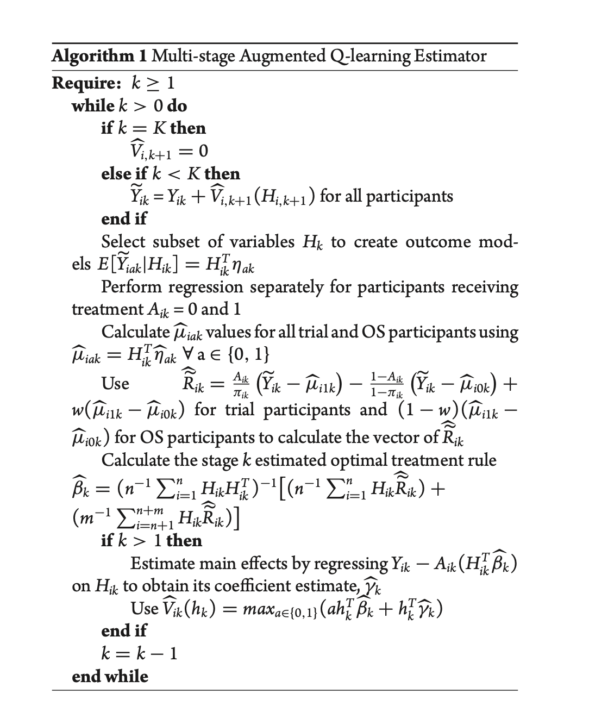
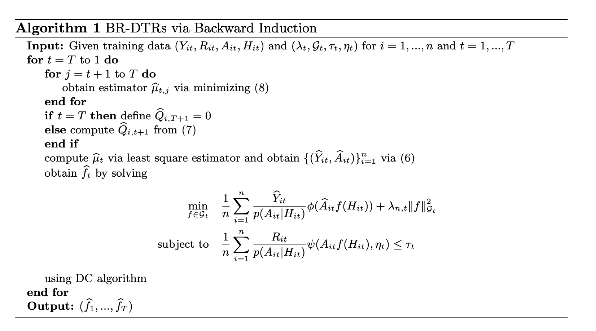

## Background
This repository contains methods and r packages developed by Dr. Donglin Zeng and his team for estimating the optimal dynamic treatment regime.dnas

## Contents

* [Section 1 - Background](#section-1---background)
* [Section 2 - Data](#section-2---data)
    + [2.1 - Clinical Trial Data](#21---clinical-trial-data)
    + [2.2 - Observation Data](#22---observation-data)
* [Section 3 - Conceptual Framework](#section-3---conceptual-framework)
* [Section 4 - Machine Learning Approaches](#section-4---machine-learning-approaches)
    + [4.1 - Augmented outcome-weighted learning](#41---augmented-outcome-weighted-learning)
        * [4.1.1 - Introduction](#411---introduction)
        * [4.1.2 - Install Packages](#412---install-packages)
        * [4.1.3 - AOL with K=1 stage](#413---AOL-with-K1-stage)
        * [4.1.4 - AOL with K=2 stage](#414---AOL-with-K2-stages)
        * [4.1.5 - Generalize to more than 2 stages](#415---generalize-to-more-than-2-stages)
        * [4.1.6 - Example](#416---example)
        * [4.1.7 - Discussion](#417---discussion)
    + [4.2 - Matched Learning for Optimizing ITRs using EHRs](#42---matched-learning-for-optimizing-itrs-using-ehrs)
        * [4.2.1 - Introduction](#421---introduction)
        * [4.2.2 - Install Packages](#422---install-packages)
        * [4.2.3 - Individualized Treatment Rules (ITRs)](#423---individualized-treatment-rules-ITRs)
        * [4.2.4 - Matched Learning (M-Learning)](#424---matched-learning-M-Learning)
        * [4.2.5 - Improved Matched Learning](#425---improved-matched-learning)
        * [4.2.6 - Example](#426---example)
        * [4.2.7 - Discussion](#427---discussion)
* [Section 5 - Optimal DTR Estimation by integrating Randomized and Observational Studies](#section-5---optimal-DTR-estimation-by-integrating-Randomized-and-Observational-studies)
    + [5.1 - Using Electronic Health Records to Improve Optimal Treatment Rules in Randomized Trials](#51---using-electronic-health-records-to-improve-optimal-treatment-rules-in-randomized-trials)
    + [5.2 - Integrating Randomized and Observational Studies to Estimate Optimal Dynamic Treatment Regimes](#52---integrating-randomized-and-observational-studies-to-estimate-optimal-dynamic-treatment-regimes)
* [Section 6 - Optimal DTR Estimation with Risk Control](#section-6---optimal-DTR-estimation-with-risk-control)
    + [6.1 - Controlling Cumulative Adverse Risk in Learning Optimal Dynamic Treatment Regimes](#61---controlling-cumulative-adverse-risk-in-learning-optimal-dynamic-treatment-regimes)
    
    + [6.2 - Learning Optimal Dynamic Treatment Regimens Subject to Stagewise Risk Controls](#62---learning-optimal-dynamic-treatment-regimens-subject-to-stagewise-risk-controls)
    


## Section 2 - Data

### 2.1 - Clinical Trial Data

Two types of data have been largely used to estimate ITRs and DTRs: Large scale Electronic health records(EHRs) and randomized controlled trial(RCT) data. As compared to RCT, EHRs data contains rich information on a large population over relatively longer time period. 

* Data Description: 
    + The examples uses a **two-stage** sequential multiple assignment randomized trial(SMART) data of 150 children with ADHD mimicking a real world study. At the first stage, children were randomized to treatment of low-intensity behavioral modification (BMOD) or low-intensity methamphetamine (MED) with equal probability. At second stage, children were randomized to treatment of low-intensity BMOD + low-intensity MED, or high-intensity BMOD with equal probability. 
   + The **primary outcome** of study was children's school performance score ranging from 1 to 5 assessed at the end of the study for all participants.
   
```r
data(adhd)
attach(adhd)

```
* Construct $H_{k}$
```r
n = length(a1)
H1 = scale(cbind(o11, o12, o13, o14))
H2 = scale(cbind(H1, a1, H1*a1, r, o22, r*a1, o22*a1))
colnames(H2)[12] = "r*a1"
colnames(H2)[13] = "o22*a1"
```

### 2.2 - Observation Data


## Section 3 - Conceptual Framework

For k = 1, 2,..., K, we consider estimating K-stage DTR:

* $X_k$ : observed subject-specific tailoring variables collected prior to the treatment assignment at stage k
* $A_k$ : treatment assignment taking values in {-1, 1}.
* $R_k$ : outcome post k-th stage treatment 
* $H_k = (X_1, A_1, R_1, ... , A_{k-1}, R_{k-1}, X_k)$ : patient history information at stage k
* $D = (D_{1}, D_{2}, \dots, D_{K})$ : DTRs or sequence of decision functions where $A_k = D_k(H_k)$
* $V(D) = E_D{[\sum_{k=1}^{K} R_k]} = = \int {\sum_{k=1}^{K} R_k} \mathrm{d} P_D$ : value function which is the expected reward given that the treatment assignments follow regimen 𝒟, where $P_D$ is the probability measure generated by random variables $(X_1, A_1, R_1, ... , X_K, A_K, R_K)$

We use the potential outcome framework from causal inference, where the **potential outcome** represents the result if a subject had followed a specific treatment regimen, which may differ from the actual regimen received during the trial. Several **assumptions** are required: 

* Standard stable unit treatment value assumption
* No unmeasured confounders assumption (satisfied in a SMART design) 
* Positivity assumption: each DTR has a positive chance of being observed. $\pi_{k}(a,h_{k}) = P(A_{k}=a|H_{k}=h_{k}) \in \left[c,\tilde{c}\right]$, where $0<c<\tilde{c}<1$

According to the work of Qian and Murphy (1):

$$
V(𝒟) = E[\frac{\prod_{k=1}^{K} I(A_k = 𝒟ₖ(H_k))(\sum_{k=1}^{K} R_k)}{ \prod_{k=1}^{K} \pi_k(A_k, H_k) }]
$$

Our **goal** is to determine the optimal DTRs $D^\*=(D_{1}^\*,D_{2}^\*,\dots, D_{K}^\*)$ that maximize the above value function. Note that $D_{k}(H_k)=\text{sign}(f_{k}(H_k))$. For clarity, we sometimes denote the value function as $V(f_1, f_2, ... , f_K)$.

## Section 4 - Machine Learning Approaches

### 4.1 - Augmented outcome-weighted learning 

In this paper, we develop the **Augmented Outcome-Weighted Learning (AOL)** method to integrate existing Outcome-Weighted Learning (OWL) method with regression models for Q-functions to estimate DTRs. It **expands data utilization** to include all patients, even those whose later-stage treatments are not optimal, thereby reducing information loss and **enhancing the stability and accuracy** of DTR estimates compared to OWL. 

[Link to the paper](AOL)

### Install Packages

To install the released package from CRAN:

```r
install.packages("DTRlearn2")
```
load it into your session:

```r
library(DTRlearn2)
```

#### 4.1.3 - AOL with K=1 stage

The main idea of AOL is to improve OWL by **replacing $R_1$ in (1) by some surrogate variable**.

$$
\mathcal{V}(𝒟) = \mathbb{E}\left[\frac{I(A_1 f(H_1) > 0)R_1}{\pi_1(A_1, H_1)}\right]
$$

$$
= \mathbb{E}\left[\frac{I(A_1 f(H_1) > 0)(R_1 - s(H_1))}{\pi_1(A_1, H_1)}\right] + \mathbb{E}[s(H_1)]
$$

$$
= \mathbb{E}\left[\frac{|(R_1 - s(H_1))|I(A_1 \text{sign}(R_1 - s(H_1))f(H_1) > 0)}{\pi_1(A_1, H_1)}\right] + \mathbb{E}[s(H_1)] - \mathbb{E}\left[\frac{(R_1 - s(H_1))^{-}}{\pi_1(A_1, H_1)}\right],  x^{-}=min(0,x)
$$

If we select a surrogate variable, $\tilde{R_{1}}=R_{1}-\hat{s_1}(H_{1})$, to replace $R_1$ and solve a weighted
support vector machine problem, then we expect to still obtain a consistent estimator of the optimal DTR.

Implementing AOL involves two main steps:

* **Step 1**: Use data $(R_{i1}, H_{i1})$ to obtain  $\hat{s}(H_1) = \hat{\gamma}_0 + {\hat{\gamma}_1}^{T} H_1$ by fitting a least squares regression or a penalized least squares regression if $H_1$ is high dimensional.


* **Step 2**: Obtain $\tilde{R_{i1}}=R_{i1}-\hat{s_1}(H_{i1})$ and fit a weighted support vector machine to estimate decision function $f_1$, where the weighted are  $\frac{|\tilde{R_{i1}}|}{\pi_{i1}}$  and the class labels are $A_{i1}sign(\tilde{R_{i1}})$, so $\hat{f_1}$ minimize:

$$ 
n^{-1}\sum_{i=1}^{n} \frac{|\tilde{R_{i1}}|}{\pi_{i1}}\phi(A_{i1}sign(\tilde{R_{i1}}))f_{1}(H_{i1})+\lambda_{n}||f_{1}||
$$

$f_1$ is from an RKHS with either linear/Gaussian kernel. Finally the **estimated optimal policy** $\hat{D}_1(H_1)=\text{sign}(\hat{f}_1(H_1))$


#### 4.1.4 - AOL with K=2 stages
Now consider K=2. We use a **backward** procedure:

* **Step 1**: Estimate the optimal treatment rule at stage 2 

    + **step 2-1**: Use data $(R_{i2}, H_{i2})$ to obtain  $\hat{s_2}(H_{2})=\hat\gamma_{0} + {\hat\gamma_{1}}^{T}H_{2}$ by fitting a least squares regression or a penalized least squares regression if $H_{i2}$ is high dimensional.
    + **step 2-2**: Obtain $\tilde{R_{i2}}=R_{i2}-\hat{s_2}(H_{i2})$ and fit a weighted support vector machine to estimate decision function $f_2$, where the weighted are $\frac{|\tilde{R_{i2}}|}{\pi_{i2}}$ and the class labels are $A_{i2}sign(\tilde{R_{i2}})$. $\hat{f_2}$ minimize: 
    
$$ 
n^{-1}\sum_{i=1}^{n} \frac{|\tilde{R_{i2}}|}{\pi_{i2}}\phi(A_{i2}sign(\tilde{R_{i2}}))f_{2}(H_{i2})+\lambda_{n}||f_{2}||
$$
    
The estimated optimal DTR at stage 2: $\hat{D}_2(H_2)=\text{sign}(\hat{f}_2(H_2))$

* **Step 2**: Estimate the optimal treatment rule at stage 1 
    + **step 1-1**: Estimate $m_{22}=\beta_{0}+\beta^{T}H_{2}$ by a weighted least squares regression
    
    + **step 1-2**: For each subject, compute: 
    $$\hat{Q_{i2}}=\frac{I(A_{i2} = \hat{D_{2}}(H_{i2})}{\pi_{i2}}R_{i2} - \frac{I(A_{i2} = \hat{D_{2}}(H_{i2}))}{\pi_{i2}}\hat{m_{22}}(H_{i2})$$
    
        * For the subjects whose treatment assignments at stage 2 are the same as the optimal treatment rule $D_{2}^{*}$,  $Q_{2}=R_{2}$.
        * For the subjects whose treatment assignments at stage 2 are not optimal, AOL uses $H_{2}$ to predict their $Q_{2}$ through augmentation 
    + **step 1-3**: obtain an estimator  $\hat{s_1}(H_1)$ for $s_1(H_1)=\alpha_0+\alpha_{1}^{T}H_1$ using a least squared estimation, where $\tilde{R_{i1}}=R_{i1}+\hat{Q_{i2}}-\hat{s_2}(H_{i1})$
    + **step 1-4** : Obtain $\hat{f_1}$ by fiting a weighted SVM with weight $\frac{|\tilde{R_{i1}}|}{\pi_{i1}}$  and the class labels are $A_{i1}sign(\tilde{R_{i1}})$, so the estimated optimal policy at stage 1 is $\hat{D}_1(H_1)=\text{sign}(\hat{f}_1(H_1))$
      
If $H_{i2}$ or $H_{i1}$ is high dimensional, we recommend that a penalized least squares regression such as Lasso be used in Step 1–1 or Step 1–3 in practice.

#### 4.1.5 - Generalize to more than 2 stages

When there are more than two stages, the same backward learning approach used from stage K, K-1, K-2, ...

However, the augmentation process for subjects with missing future optimal reward increments becomes more complicated.

**To estimate the optimal $(k-1)$ th stage treatment rule, we have:**

* Some extra notations:
    + $M_{ik}^{j}$ : whether subject $i$ follows the treatment regime from stage $k$ to $j$, for $j \ge k$

      $$M_{ik}^{j} = I(A_{ik}=D_{k}^\*(H_{ik}), \dots, A_{ij}=D_{j}^\*(H_{ij}))$$

    + $M_{ik}^{k-1}=1$
    + $Q_{ik}$: The optimal reward increment for patient $i$ if she/he follows the estimated optimal rule from stage $k$ to $K$, where $m_{kj}(H_{ij})$ is the optimal reward increment for subjects who receive optimal treatments
up to stage $(j − 1)$, which is estimated as: 

$$\hat{Q_{ik}} = \frac{\hat{M_{ik}^{K}} (R_{ik} + \dots + R_{iK})}{\prod_{l=k}^{K} \pi_{il}}-\sum_{j=k}^{K}    \left(\frac{\hat{M_{ik}^{j-1}}}{\prod_{l=k}^{j-1} \pi_{il}} \left(\frac{I(A_{ij} = \hat{D_{j}}(H_{ij}))}{\pi_{ij}} - 1 \right) \hat{m_{kj}}(H_{ij}) \right)$$
* Algorithm: 

<p align="center">
    
</p>

#### 4.1.6 - Example

* **Step 1 : This function implements a variety of outcome-weighted learning methods for estimating general 2-stage DTRs**
```r
fit_owl = owl(H=list(H1, H2), AA=list(a1,a2), RR=list(rep(0, n), y),
              n=n, K=2, pi=list(rep(0.5, n), rep(0.5,n)), res.lasso = TRUE,
              loss="hinge", kernel="linear", augment=TRUE, c=c, m=3)
```
* $H_{k}$: It could be a vector (K=1) or matrix (K>1). All the variables should be standardize to have mean 0 and standard deviation 1 before using H as the input.

* AA : observed treatment assignments for all subjects at the K stages. 

* RR ：observed reward outcomes for all subjects at the K stages

* n ：sample size

* K : number of stages

* pi : treatment assignment probabilities of the observed treatments for all subjects at the K stages.
   + It can be a user specified input if known. 
   + The default is pi="estimated", that is we estimate the treatment assignment probabilities based on lasso-penalized logistic regressions with $H_{k}$ being the predictors at each stage k.

* res.lasso : whether or not to use lasso penalty in the regression to take residuals for constructing the weights 

* loss : loss function for sovling the weighted classification problem at each stage
  + "hinge" : SVM hinge loss
  + "ramp" : SVM ramp loss
  + "ramp" : SVM ramp loss
  + "logit" ("logit.lasso") :  binomial deviance loss used in the logistic regression (with lasso applied or not)
  +  "l2"("l2.lasso") : L2 or square loss (with lasso applied or not)

* kernel : The kernel function to use under SVM hinge loss or SVM ramp loss. "linear" and "rbf" kernel are implemented under SVM hinge loss; "linear" kernel is implemented under SVM ramp loss. The default is kernel="linear".

* augment : whether or not to use augmented outcomes

* c	: A vector specifies the values of the regularization parameter C for tuning under SVM hinge loss or SVM ramp loss. The default is c=2^(-2:2).

* sigma : A vector specifies the values of the positive parameter $\sigma$ in the RBF kernel for tuning under SVM hinge loss

* m : number of folds in the m-fold cross validation

* **Step 2 : Predict from a Fitted "owl" Object**
   + It can recommend treatments for a new independent sample with partial or full subject features observed up to a certain stage. 
   + If subject feautures, treatment assignments and outcomes are fully observed in the new sample, this function can also evaluate the estimated DTR on this new sample, returning the empirical value function and benefit function.
 
```r
# estimate DTR with owl on the training sample
owl_train = owl(H=list(H1_train, H2_train), AA=train$A, RR=train$R, n=n_train, K=2,
    pi=pi_train, loss='hinge', augment=TRUE, m=3)
```

A list od results: 
```r
#estimated coefficient of H1 in decision function of stage 1
fit_owl$stage1$beta

#the estimated probability for each subject
fit_owl$stage1$treatment

#overall empirical benefit function under estimated DTR
fit_owl$valuefun
```


```r
# evaluate the DTR when full information are observed on the new sample
owl_test = predict(owl_train, H=list(H1_test, H2_test), AA=test$A, RR=test$R, K=2)

```

A list of output 
```r
#recommended optimal treatments at the K stages for each subject in test sample
owl_test$treatment

#overall value function under fitted DTR evaluated on the test sample 
owl_test$valuefun

#treatment assignment probabilities in test sample
owl_test$pi

```


#### 4.1.7 - Discussion

This work introduces a new machine learning method called AOL (Augmented Outcome-Weighted Learning) to estimate optimal Dynamic Treatment Regimens (DTRs) by enhancing the OWL (Outcome-Weighted Learning) method. AOL improves efficiency over OWL for both single-stage and multi-stage settings by reducing stochastic error while maintaining the same approximation bias. It achieves this by constructing surrogate outcomes with smaller second moments. The method is more stable computationally than alternatives and performs better in real-world settings with non-differentiating noise variables or unknown treatment mechanisms.

There are potential benefits of incorporating advanced prediction methods like random forests for capturing nonlinear interactions, though a linear model still ensures AOL's efficiency over OWL. Clinicians may find AOL useful for identifying important variables that predict patient responses, especially in the discovery of biomarkers for tailoring treatments. Future research could explore automatic variable selection within the AOL framework and use nonlinear decision functions or decision trees to enhance interpretability and performance for high-dimensional data.


### 4.2 - Matched Learning for Optimizing ITRs using EHRs

#### 4.2.1 - Introduction

Personalized medicine aims to customize treatment based on individual characteristics, using advanced data collection and analysis techniques to enhance patient outcomes, reduce side effects, and improve adherence to therapies. Machine learning methods like Q-learning, outcome weighted learning, boosting-based treatment selection, augmented O-learning, and subgroup identification are employed to estimate individualized treatment rules (ITRs) and dynamic treatment rules (DTRs). Although these methods have primarily analyzed randomized clinical trial (RCT) data, their use in real-world settings is limited due to the restrictive nature of RCTs, which affects generalization and the availability of long-term outcome data.

The growing access to **large-scale electronic health records (EHRs)** is enhancing opportunities to learn ITRs using real-world patient data. EHRs, with their extensive coverage and long-term data, offer a more realistic view of patient care and medication patterns that RCTs often miss. This makes EHRs a valuable complement to traditional clinical trial data, particularly for personalized medicine research. However, using EHRs for research presents significant **challenges** due to their non-research intent:

* **Confounding Bias and selection bias**
* **Inverse Probability Weighting(IPW)** of propensity scores is commonly used to adjust for confounding, but it can encounter several potential issues:
     + Extreme weights with high variability
     + Does not adequately balance covariate distributions between treatment groups, especially when the distribution of propensity scores shows little overlap between treatment arms.
     
We introduced **Matched Learning (M-learning)**, a new machine learning approach that applies matching to estimate **ITRs** by aligning treatment responses of treated and untreated subjects using **EHR** data. M-learning integrates aspects of O-learning and AOL within its framework, employing matching-based functions to address confounding in different data types (continuous, discrete, or ordinal). Enhanced by **denoising and doubly robust** matching techniques, M-learning is implemented using a **weighted support vector machine**, demonstrating improved performance over existing methods, especially when dealing with misspecified propensity scores or unmeasured confounders. We apply M-learning to determine optimal second-line treatments for type 2 diabetes at New York Presbyterian Hospital, focusing on improving outcomes and tackling EHR-specific challenges like confounding biases and selection bias.


#### 4.2.2 - Install Packages

#### 4.2.3 - Individualized Treatment Rules (ITRs)

The conceptual framework of ITRs is similar to that of single-stage DTRs. For the O-learning approach introduced in Section 5.1, the value function is defined as: 

$$
V(D)=E[\frac{I(A_i=D(H_i))R_i}{\pi(A_i,H_i)}].  (1)              
$$

For RCTs, the  assumption that the potential outcomes are independent of treatment assignment given covariates is satisfied with treatment assignment probability $\pi(a,h)=Pr(A_i=a|H_i=h)$ is **known** by design. However, treatment assignment probabilities are **unknown** and need to be estimated from data in observations study. The objective function (1) and IPW-based methods in observational studies often suffer from instability and increased variance, particularly when weights are highly variable. Additionally, IPW-based methods do not directly ensure covariate distribution balance between treatment groups.

#### 4.2.4 - Matched Learning (M-Learning)

**Step 1: Matching Subjects**

When comparing responses to different treatments, matching methods can be designed to ensure balanced distributions at the subgroup level. These methods offer flexible tools to control the matching quality of key confounders within subgroups or even at the level of individual subjects. In our method, we denote the matched set for subject i as $M_i$ which consists of subjects with opposite treatments but similar covariates as subject i, where similarity is defined under a suitable distance metric. That is, we let: 


$$M_i= [j: A_j = -A_i, d(H_j, H_i) \le \delta_i]$$

where $d(,)$ is a metric defined on covariate space and $\delta_i$ is a pre-specified positive threshold to determine the size of the matched set. In this method, we use nearest neighbor in the matching step of M learning.

**Step 2: Construct Matching Based Value Function Based on Matched Subjects**

The **motivation** of M learning is that when two subjects are matched in confounders or propensity scores of treatments but are observed to receive opposite treatments, the subject with a larger clinical outcome should be more likely to have received the optimal treatment among two options. Based on this rational, we expect that if $j \in M_i$ and $R_j \ge R_i$, then the optimal ITR for subject $i$ should be more likely to be $A_j$, and vice versa. The likelihood is expected to be greater if difference between $R_j$ and $R_i$ is larger. The M learning maximizes:

$$V_{n}(f;g) = n^{-1} \sum_{i = 1}^{n} |M_{i}|^{-1} \sum_{j \in M_{i}} I(f(H_{i})A_{i}sign(R_{j}-R_{i}) \le 0)g(|R_{j}-R_{i}|)$$

or minimizes equivalently: 

$$V_{n}(f;g) = n^{-1} \sum_{i = 1}^{n} |M_{i}|^{-1} \sum_{j \in M_{i}} I(f(H_{i})A_{i}sign(R_{j}-R_{i}) \ge 0)g(|R_{j}-R_{i}|)$$

where $|M_i|$ is the size of $M_i$ and $g(.)$ is a monotonically increasing function specified by users to weight different pairs of subjects. Typical choices of $g(.)$ can be $g(x) = 1$ or $g(x) = x$. The objective function can be further expanded by allowing $M_i = i$ (match subject $i$ with himself/herself). 

**Extensions to O-Learning and AOL Methods based on value function:**

* If we replace $R_j$ by subject $i$ ’s predicted outcome estimated from a parametric model including only the main effects of $H_i$ , M-learning reduces to the single-stage AOL. 
* If in addition we replace $R_j$ by zero (when $R_j>0$ for all subjects) or the smallest observed outcome when negative outcomes are present and choose $g(x)=x$ , M-learning reduces to the original O-learning

Thus, O-learning and single-stage AOL are specific cases of M-learning, where they compare the observed outcome $R_i$ with either a constant or the predicted outcome given $H_i$, averaged across treatments. In contrast, M-learning compares observed individual outcomes from two subjects in a matched set, where treatment assignment is approximately "random" given $H_i$, but the treatments received are opposite. Consequently, M-learning provides more detailed information by considering each patient’s outcome individually rather than comparing a patient’s outcome to an averaged predicted outcome across treatments.

** Step3: Optimization:**

As in O-learning, we replace the zero-one loss with surrogate loss functions. Specifically, when using hinge loss, the objective function becomes the loss function for a weighted support vector machine (SVM) with matched pairs:

$$V_{n,\phi}(f;g) = n^{-1} \sum_{i = 1}^{n} |M_{i}|^{-1} \sum_{j \in M_{i}} \phi(-f(H_{i})A_{i}sign(R_{j}-R_{i}))g(|R_{j}-R_{i}|)+\lambda_{n}||f||_{H_K}$$

where $\phi(x)=(1-x)_+$, ${\lambda}_n$ is a tuning parameter and $H_K$ is a reproducing kernel Hilbert space with kernel function $K(.,.)$. The solution of M learning can be obtained by minimizing this value function, and its dual problem, a quadratic program, can be solved using standard packages with Lagrange multipliers for linear ITRs:  

$$min \frac{1}{2}||\beta||^2+C\sum_{i=1}^{n}\sum_{j \in M_i}|M_i|^{-1}g(|R_j-R_i|)\xi_{ij}$$

subject to: $A_isign(R_i-R_j)(\langle \beta, H_i \rangle+\beta_0)\ge (1-\xi_{ij}), \xi_{ij}\ge 0$, where $\xi_{ij}$ is a slack variable that represents misclassification error for jth subject in the matched set of the ith subject, C is the cost parameter and $|M_i|^{-1}g(|R_j-R_i|)$ is the individual specific weight in a weighted SVM framework.

The lagrange primal fucntion follows as:
$$\frac{1}{2}||\beta||^2+C\sum_{i=1}^{n}\sum_{j \in M_i}|M_i|^{-1}g(|R_j-R_i|)\xi_{ij}-\sum_{i=1}^{n}\sum_{j \in M_i}\alpha_{ij}[A_isign(R_i-R_j)({H_i}^T\beta+\beta_0)-(1-\xi_{ij})]-\sum_{i=1}^{n}\sum_{j \in M_i}\mu_{ij}\xi{ij}$$

#### 4.2.5 - Improved Matched Learning

To improve the performance of M-learning, we use a de-noise procedure by replacing $R_i$ by a surrogate outcome $\tilde{R_i}=R_i-s(H_i)$ in $V_n(D;g)$. These residualized outcomes remove the main effects of covariates, which improves efficiency of identifying tailoring variables exhibiting quantitative or qualitative interaction with treatment.The value function to be maximized becomes: 

$$V_{n}(f;g) = n^{-1} \sum_{i = 1}^{n} |M_{i}|^{-1} \sum_{j \in M_{i}} I(f(H_{i})A_{i}sign(\tilde{R_{j}}-\tilde{R_{i}}) \le 0)g(|\tilde{R_{j}}-\tilde{R_{i}}|)$$

Furthermore, prognostic scores can be incorporated into M-learning under the framework of doubly robust matching estimator(DRME), which uses both propensity scores and prognostic scores to construct a matching set $M(i,\theta)$, where $\theta=(\theta_1,\theta_2)^T$.

$$\pi(H)=P(A=1|H)=\mu_1(H^T\theta_1)$$
$$m(H)=E(R|A=-1,H)=\mu_2(H^T\theta_2)$$

The doubly robust M-learning is consistent even if one of the propensity score model or prognostic model is misspecified, and it will be more efficient than regular M-learning if both models are correctly specified. Note that M-learning can be applied to RCT data where only prognostic scores need to be included in the matching step to improve efficiency.

#### 4.2.6 - Example


#### 4.2.7 - Discussion
The M-learning approach is a machine learning method based on matching, designed to estimate optimal ITRs from observational data. M-learning extends beyond O-learning by including it as a special case, offering greater flexibility and satisfying Fisher consistency. It incorporates a general matching function that supports both continuous and discrete outcomes, allowing optimization based on metrics like AUC. The approach avoids dependence on propensity scores or inverse weighting, reducing instability from small weights. Instead, M-learning utilizes a suite of matching methods, such as nearest neighbor and dimension-reduced matching based on propensity or prognostic scores, to enhance robustness and personalization. High-dimensional covariates can be managed through dimension reduction, focusing on key confounders, propensity scores, and prognostic scores to achieve balance. M-learning can be adapted to multi-stage settings, handle multiple treatment options, and consider both efficacy and safety outcomes. This study’s application was based on EHR data from a single center but could be expanded to other datasets to validate M-learning’s effectiveness across diverse populations.

## Section 5 - Optimal DTR Estimation by integrating Randomized and Observational Studies

### 5.1 - Using Electronic Health Records to Improve Optimal Treatment Rules in Randomized Trials

RCTs provide robust data for developing ITRs but lack generalizability, while EHRs offer real-world insights that could enhance ITR applicability, though their integration with RCTs is challenging due to confounding effects and patient differences. This paper proposes a novel method to improve ITRs by incorporating EHR-derived **super features**, treatment prescription propensity and benefit, into RCT data. By augmenting RCT data with these features and using stratified learning with Q-learning and modified M-learning, the method enhances the accuracy of ITRs. Unlike traditional domain adaptation, it directly extracts informative features from EHRs to optimize the value function, making the ITRs more applicable to the larger EHR population.

### Domain Adaptation to Improve Learning ITRs
Our goal is to extract information from EHR data and incorporate it into learning the optimal ITR from trial data, a process we term as **“domain adaptation”**. We pre-train feature mappings from EHR data to enhance the RCT feature space, focusing on two key features: **physician prescription patterns** and **observed benefits under the optimal treatment**. This domain adaption method contains two steps:

* **Step 1 : Construct “Super Features”**

     + The first super feature,  $H_1$, represents the probability that a physician prescribes an optimal treatment  $a_0$ based on a patient’s covariates in the EHR. To construct $H_1$ , an ITR  ${\hat D}(X_c)$  is **pre-trained** from EHR data using **shared** pre-treatment covariates  $X_c$ in the EHR and RCT data. A classification model (e.g., random forest or logistic regression) is then fitted to estimate the probability of a physician prescribing the optimal treatment  $a_0$  based on  $X_c$ , using **only** EHR patients who received the **predicted optimal** treatment from  $\hat D(X_c)$, with ${\hat f}_1(X_c) = {\hat P} (A=a_0| A=\hat D(X_c), X_c)$. This fitted model is then applied to RCT subjects to obtain their predicted optimal treatment probability,  $H_1 = \hat f_1(x_c)$.

     + The second super feature, $H_2$, is a benefit feature that measures the observed gain or loss in a patient’s outcome when receiving the optimal treatment, calculated as the **expected difference** in outcome between the optimal and non-optimal treatments. To obtain  $H_2$ , a random forest regression model is first used on EHR data to estimate outcomes under both the optimal treatment,  $E(R | A = \hat D(X_c), X_c)$ , and the non-optimal treatment,  $E(R | A = -\hat D(X_c), X_c)$. $H_2$ , is defined as the benefit ${\hat f_2}(X_c) = E(R | A = \hat D(X_c), X_c) - E(R | A = -\hat D(X_c), X_c)$. This benefit function is then applied to RCT subjects to obtain their predicted benefit as  $H_2 = \hat f_2(x_c)$.
    
* **Step 2 : Estimation of Optimal ITRs Using Augmented Feature Space**

     + The final optimal ITRs are then estimated using RCT subjects in an augmented feature space that includes both original RCT features and EHR super features. 
     
         * **Approach 1**: Learn the optimal ITRs by using the combined features $(H_1, H_2, X)$
         * **Approach 2**: To enhance the influence of super features, they are treated as key variables through **stratification**, where patients are grouped into strata based on one or both super features, and optimal ITRs are learned separately within each stratum.
         
<p align="center">
    
</p>

### Algorithm

<p align="center">
    
</p>


### 5.2 - Integrating Randomized and Observational Studies to Estimate Optimal Dynamic Treatment Regimes

We introduce the **multi-stage augmented Q-learning estimator(MAQE)** to improve the efficiency of estimation of optimal DTRs by by augmenting SMART data with observational data. By combining data from both sources, MAQE enables analysis on a more heterogeneous pooled participant population while maintaining the validity of causal treatment effects.

[Link to the Paper](MAQE)

<p align="center">
    
</p>


### Method

MAQE enables pooled data analysis across all **K** stages, incorporating **m** observational study participants and **n** trial participants. It estimates the **contrast** between **potential outcomes** for a given participant if they were to receive treatment 1 versus treatment 0 at each k. Directly assessing this contrast in trial data is easy, but challenging for observational data due to unmeasured confounders and the unknown $\pi_{ik}$. To solve that issue, a doubly robust estimator that leverages both OS and trial data at **stage K** is used and the contrast can be expressed as:

$$
E\left[\hat{R_{iK}}|H_{iK}=h,i \in trial\right]+E\left[\hat{R_{iK}}|H_{iK}=h, i \in OS\right]
$$
$$ \hat{R_{iK}}=\frac{A_{iK}}{\pi_{iK}}(Y_{iK}-\hat{\mu_{i1K}})-\frac{1-A_{iK}}{1-\pi_{iK}}(Y_{iK}-\hat{\mu_{i0K}})+w(\hat{\mu_{i1K}}-\hat{\mu_{i0K}}), i \in trial$$
$$ \hat{R_{iK}}=(1-w)(hat{\mu_{i1K}}-\hat{\mu_{i0K}}), i \in OS$$

$Y_{iK}$ is the observed outcome and $\hat{\mu_{i1K}}$, $\hat{\mu_{i0K}}$ represents the predicted potential outcome for participants receiving treatment 1 and treatment 0, respectively. We first regress $Y_{iK}$ on $H_{iK}$ separately by treatment groups using **trial data only** to obtain parameters $\eta_{aK}$, which are then used to estimate $\hat{\mu_{iaK}}$, in **both OS and trial data**. $w \in (0,1)$, represents the weight assigned to the contribution of the contrast term from the trial data or OS.

$$
\hat{\beta_{K}}=(n^{-1}\sum_{i=1}^{n}H_{iK}{H_{iK}}^T)^{-1}\left[(n^{-1}\sum_{i=1}^{n}H_{iK}\hat{R_{iK}})+(m^{-1}\sum_{i=n+1}^{m+n}H_{iK}\hat{R_{iK}})\right]
$$

The estimated optimal treatment at stage K is $\hat{d^*_K}=I(h^T_K\hat{\beta_K}>0)$.

To estimate the optimal **stage K-1** treatment rule, we must calculate the predicted outcome at stage K if the optimal treatment rule were followed: 

$$
\hat{V_{iK}}(h_{iK})=\max_{a_K \in {0,1}}(a_Kh^T_{iK}\hat{\beta_K}+h^T_{iK}\hat{\gamma_K})
$$

$\hat{\gamma_K}$ is estimated by regressing $Y_{iK}-A_{iK}H^T_{iK}\hat{\beta_K}$, the residual after removing main effect, on $H_{iK}$. The peseudo-outcome is then calculated as $\tilde{Y_{i, K-1}}=Y_{i, K-1}+\hat{V_{iK}}(H_{iK})$, which is subsequently used to estimate the predicted contrast function. 

We continue the same procedures **backward** until stage 1. The estimated optimal treatment for K stages is:  $\hat{d^*}=I(h^T_K\hat{\beta_K}>0, h^T_{K-1}\hat{\beta_{K-1}}>0, \dots, h^T_{1}\hat{\beta_{1}}>0)$. 

### Algorithm

<p align="center">
    
</p>


### Result and Discussion

We show that, across various simulation parameters, the MAQE consistently **outperforms** the SQE in estimating the optimal treatment sequence, with a higher average value.

<p align="center">
    
</p>


The method's performance depends on confounding bias in OS data. We anticipate that when there is minimal bias, integrating OS data, even with a small sample size, can yield significant improvement compared to using SMART data alone. 

### Example Code 

[example code](MAQE)

## Section 6 - Optimal DTR Estimation with Risk Control
In this section, we assume that $Y$, $R$ are bounded random variables, representing the beneficial reward and risk outcomes, respectively. 
### 6.1 - Controlling Cumulative Adverse Risk in Learning Optimal Dynamic Treatment Regimes
**Benefit-risk tradeoff** is crucial in personalized medicine, where aggressive treatments may enhance efficacy but increase long-term risks. In DTRs, early treatments impact both benefits and risks of later stages, requiring careful consideration of cumulative risk. We introduce a new statistical learning framework called **multistage cumulative benefit-risk(CBR)** framework, to estimate DTRs by simultaneously maximizing the expected benefit and controlling the expected cumulative risk. There are two methods developed to solve CBR: 
* (1) A backward algorithm based on Q-learning or O-learning with new **"benefit-risk"** outcome
* (2) A simultaneous algorithm taking advantage of **multistage ramp loss (MRL)** to estimate the DTRs across all stages.

[Link to the Paper](CBR)

### CBR Framework

Consider a T-stage decision problem. To control the cumulative risk, we formulate the CBR problem as seeking the optimal rule $D^\*=(D_{1,\gamma}^\*,D_{2,\gamma}^\*,\dots, D_{T,\gamma}^\*)$ that solves the optimization problem with a pre-specified risk constraint $\tau$: 

$$
\max_D \quad E^D[Y \frac{\prod_{t=1}^{T} I(A_t=D_t(H_t))}{\prod_{t=1}^{T} p(A_t|H_t)}], \quad subject \quad to \quad E^D[R \frac{\prod_{t=1}^{T} I(A_t=D_t(H_t))}{\prod_{t=1}^{T} p(A_t|H_t)}] \le \tau \quad (1)
$$ 

Y is the **total reward** and R is the **cumulative risk** by the end of stage T. $D^*_{\gamma}$ can also be solved in a Lagrange function of (1), where $\gamma \in [0.1]$:

$$
\arg\max_D \quad E[((1-\gamma)Y-\gamma R) \frac{\prod_{t=1}^{T} I(A_t=D_t(H_t))}{\prod_{t=1}^{T} p(A_t|H_t)}] \quad (2)
$$

The expected risk associated with optimal decision rules is defined as $R(\gamma)=E[R \frac{\prod_{t=1}^{T} I(A_t=D_{t,\gamma}^\*(H_t))}{\prod_{t=1}^{T} p(A_t|H_t)}]$.  In addition to the general assumptions typically made in DTR frameworks, a **new assumption** is introduced: $R(\gamma)$ is assumed to be a continuous function for $\gamma \in [0,1]$ and $R(1)< \tau \le R(0)$. To solve the CBR problem under these assumptions, we only need to find the $\gamma^\*$ that satisfies: $R(y^\*)=\tau$.

### Backward Algorithm
CBR problems can be solved in backward algorithm using existing methods such as Q-learning, O-learning, backward OWL and AOWL, after treating $(1-\gamma)Y-\gamma R$ as the reward outcome. Take Q learning as an example: 

$$
Q_{t,\gamma}(h_t,a_t)=E[argmax_{a_{t+1}} Q_{t+1,\gamma}(H_{t+1},a_{t+1})|H_t=h_t, A_t=a_t]
$$

Then the optimal solution for $D_{\gamma}^\*$ is $D_{t,\gamma}^\*(h_t)=sign(Q_{t,\gamma}(h_t,1)-Q_{t,\gamma}(h_t,-1)), \quad t=1,\dots, T$ 

### Simultaneous Algorithm
One potential drawback of using backward induction methods is that estimation errors from later stages, caused by model misspecification or overfitting, can be accumulated and present in early stage estimation. To overcome these disadvantages, we propose a simultaneous algorithm called **multi-stage ramp loss (MRL)**. The **key idea** is to replace the multivariate 0-1 indicator function in (2) with a **continuous surrogate function** to be directly optimized without backward algorithm. We define a  piecewise linear function given by $\psi(x)=max(min(x,1),0)$ and replace (2) as:

$$
\max_{f_1,\dots,f_T} E[{O_{\gamma}}^\+ \frac{min(\psi(A_1f_1(H_1)),\dots,\psi(A_Tf_T(H_T)))}{\prod_{t=1}^{T} p(A_t|H_t)}]+E[\sum_{a_t \neq A_t} {O_{\gamma}}^\- \frac{min(\psi(a_1f_1(H_1)),\dots,\psi(a_Tf_T(H_T)))}{\prod_{t=1}^{T} p(A_t|H_t)}] \quad (3)
$$

* Decision function $f_{t_1}$ is not required to be estimated before or after $f_{t_2}$, which implies MRL solves the optimal decision rules **simultaneously**. 
* By reverting the observed treatments to any other treatment sequences, we ensures that the weights are always **nonnegative** even if $Q_{\gamma}$ is negative. 

In empirical data, we propose to solve:

$$
\max_{f_1,\dots,f_T} \frac{1}{n}\sum_{i=1}^{n}\hat{{O_{i,\gamma}}^\+} \frac{min(\psi(A_{i1}f_1(H_{i1})),\dots,\psi(A_{iT}f_T(H_{iT})))}{\prod_{t=1}^{T} p(A_{it}|H_{it})}+\frac{1}{n}\sum_{i=1}^{n} \sum_{a_t \neq A_{it}} \hat{{O_{i,\gamma}}^\-} \frac{min(\psi(a_{1}f_1(H_{i1})),\dots,\psi(a_{T}f_T(H_{iT})))}{\prod_{t=1}^{T} p(A_{it}|H_{it})}]-\sum_{t=1}^{T} \lambda_{n,t}||f_t||^2 \quad (3)
$$

Similar to the augmentation technique used in AOWL, we replace $O_{i,\gamma}$ by $\hat{O_{i,\gamma}}=O_{i,\gamma}-\hat{m}(H_{i1})$, where $\hat{m}(H_1)$ is an estimator of the conditional expectation of $O_{\gamma}$ given baseline feature variables $H_1$. Computationally, the objective function of (3) can be further decomposed as the difference between two convex functions. Therefore, one can adopt the **difference of convex (DC)** algorithm to solve (3) iteratively.

### Estimating ${\gamma}^\*$ Using the Risk Control
We propose to estimate ${\gamma}^\*$ based on the smooth approximation of $R(\gamma)$ by solving:

$$
\frac{1}{n}\sum_{i=1}^{n}R_i\frac{min(\psi(A_{i1}\hat{f_{1,\hat{\gamma}}}(H_{i1})/\eta),\dots,\psi(A_{iT}\hat{f_{T,\hat{\gamma}}}(H_{iT})/\eta))}{\prod_{t=1}^{T} p(A_{it}|H_{it})}=\tau, 
$$

$\eta \in (0,1]$ is a shifting parameter to be chosen data dependently
### Algorithm
<p align="center">
    
</p>

### Result
Simulation studies and the real data example indicated that using MRL, O-learning, or Q-learning along with the proposed procedure would yield well-performed DTRs with the risk being controlled under or close to the risk constraint.

<p align="center">
    
</p>

The proposed MRL method solves unconstrained DTR problems by estimating treatment rules jointly without distinguishing early stages from later stages. It can be generalized to handle multiple constraints and treatment types but computational refinements are required. 

### Example code

[example code](CBR)

### 6.2 - Learning Optimal Dynamic Treatment Regimens Subject to Stagewise Risk Controls
To address the benefit-risk challenge presented in chronic disease, we develop a general framework called **benefit-risk DTRs (BR-DTRs)**. This framework is designed to learn the optimal DTRs in a **multistage** study subject to different acute risk constraints at each stage. We propose a **backward** procedure to estimate the optimal treatment rules by maximizing the expected value function under the **risk constraint** imposed at each stage, which can be solved as a **constrained support vector machine problem**.

### BR-DTRs Framework
The goal of BR-DTRs is to find the optimal rule $D^*$ that maximizes the cumulative reward at the final stage T , while the risk at each stage t is controlled by a pre-specified risk constraint, denoted by $\tau_t$. We capture the acute risk characteristics of chronic disease and assume that, for the same individual, the adverse risk at each stage is caused by their **most recent** treatment. Given data from n i.i.d. patients, we propose to solve the surrogate problem to estimate the optimal DTRs empirically. W e define $A_{t,n}$ as: 

$$
f \in F_t|\frac{1}{n}\sum_{i=1}^{n} \frac{R_{it}\psi(A_{it}f(H_{it}),\eta_t)}{p(A_{it}|H_{it})} \le \tau_t
$$

then we solve:

$$
\hat{f_t}=\arg\min_{f \in A_{t,n}} \frac{1}{n}\sum_{i=1}^{n}\frac{(\sum_{s=t}^{T}Y_{is})\prod_{s=t+1}^{T}I(A_{is}\hat{f_s}(H_{is})>0)}{\prod_{s=t}^{T}p(A_{is}|H_{is})}\phi(A_{it}f(H_{it}))+\lambda_{n,t}{\| f \|^2}_{F_t} \quad (1)
$$

The **hinge loss** is defined as $\phi(x)=(1-x)_{+}$ and the **shifted ramp loss** function is given by: 

$$
\psi(x, \eta) =
\begin{cases} 
1, & \text{if } x \geq 0, \\
\frac{x + \eta}{\eta}, & \text{if } x \in (-\eta, 0), \\
0, & \text{if } x \leq -\eta.
\end{cases}
$$

### Augmentation

We then adopt the **augmentation** technique(AOWL in 4.1) to further improve the efficiency and stability of the estimation procedure. We replace the $Y_{it}$ and $A_{it}$ by:

$$
\hat{Y_{it}}=Y_{it}+\hat{Q_{i,t+1}}-\hat{\mu_t}(H_{it}), \quad \hat{A_{it}}=A_{it}*sign(Y_{it}+\hat{Q_{i,t+1}},-\hat{\mu_t}(H_{it}))
$$

The augmented Q-function defined as ($\hat{Q_{i,T+1}}=0$):

$$
\hat{Q_{i,t+1}}=\frac{(\sum_{s=t+1}^{T}Y_{is})\prod_{s=t+1}^{T}I(A_{is}\hat{f_s}(H_{is})>0)}{\prod_{s=t+1}^{T}p(A_{is}|H_{is})}-\sum_{j=t+1}^{T}\frac{\prod_{s=t+1}^{j-1}I(A_{is}\hat{f_s}(H_{is})>0)}{\prod_{s=t+1}^{j-1}p(A_{is}|H_{is})}[\frac{I(A_{ij}\hat{f_j}(H_{ij}))}{p(A_{ij}|H_{ij})}-1]\hat{\mu_{t+1,j}}(H_{ij})
$$

Intuitively, $\mu_{t,j}$ in the augmented Q-functions are contributions to the loss function for patients whose received treatments are not optimal, which is estimated by solving the weighted least square:

$$
\frac{1}{n}\sum_{i=1}^{n}\frac{\prod_{s=t}^{T}I(A_{is}\hat{f_s}(H_{is})>0)}{\prod_{s=t}^{T}p(A_{is}|H_{is})}\frac{1-p(A_{ij}|H_{ij})}{\prod_{s=t}^{j}p(A_{is}|H_{is})}(\sum_{s=t}^{T}Y_{is}-\mu_{t,j}(H_{ij}))^2
$$

$\mu_t$ are introduced to remove the main effect which could further reduce the weight variability, estimated by minimizing: $\sum_{i=1}^{n}(Y_{it}+\hat{Q_{i,t+1}}-\mu_t(H_{it}))^2$

### Backward Algorithm
<p align="center">
    
</p>

### Result
The results in Table 1 compare the performance of BR-DTRs to AOWL, which ignores the risk constraints, and the naive method, which considers the risk constraints but uses the immediate outcomes as the reward. In summary, BR-DTRs provide valid decision rules with risks near pre-specified thresholds. 

<p align="center">
    
</p>

However, there are several **limitations**:
* It may not perform well for a very large number of horizons(T).
* It may not be applicable in cases where risks are affected by earlier actions.

<a href="#top">Back to top</a> 
## Table of Contents


